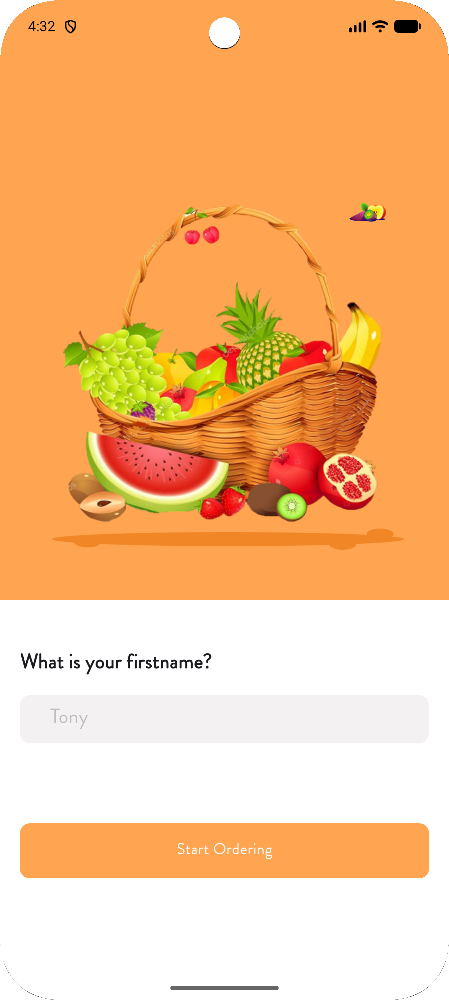
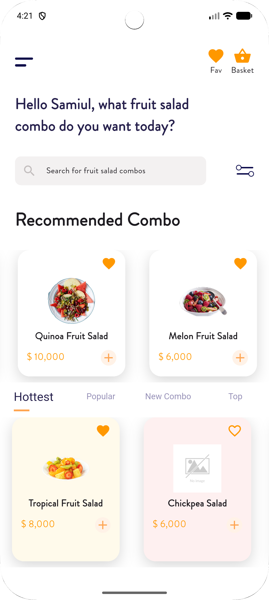
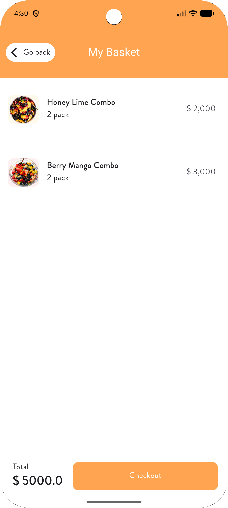
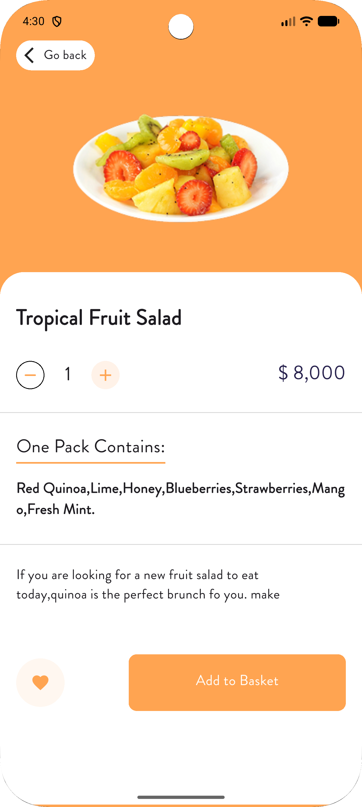
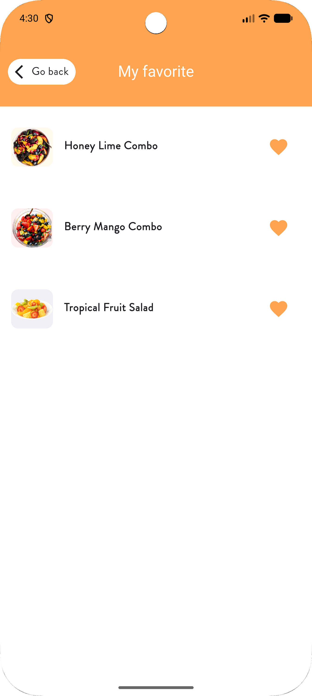

# 🍔 Food Hub App


A Flutter-based Food Ordering app with modern UI, fully responsive design, and seamless user experience. Users can browse food items, add to cart, and manage favorites.

---

## 📑 Table of Contents
- [Features](#-features)
- [App Preview](#-app-preview)
- [Tech Stack](#-tech-stack)
- [Installation](#-installation)
- [Author](#-author)

---

## 🚀 Features
- 🍱 Modern Food UI with categorized sections  
- 🛒 Add to Cart Interface  
- ❤️ Favorite Management  
- 🔍 Search & Filter Options  
- 📱 Fully Responsive Layout  
- 🎨 Custom Color Theme  

---

## 🖼️ App Preview

| Onboard | Home | Cart |
|----------|------|------|
|  |  |  |

| Details | Favorite |
|----------|-----------|
|  |  |

---

## ⚙️ Tech Stack
- Flutter & Dart  
- GetX for State Management  
- Firebase (if used)  
- Custom UI Components  

---

## 📦 Installation

```bash
# Clone the repository
git clone https://github.com/samiul-basir-46/food_hub.git

# Navigate to project directory
cd food_hub

# Get dependencies
flutter pub get

# Run the app
flutter run
